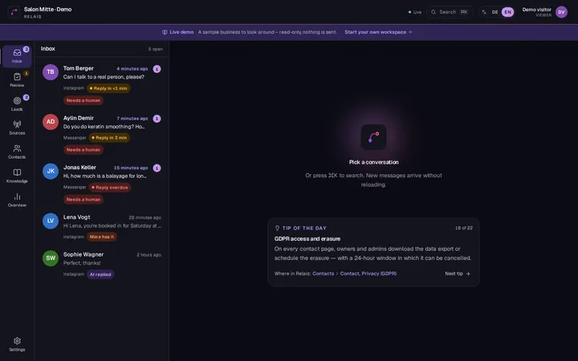
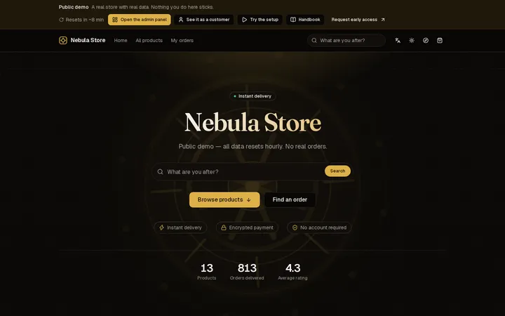
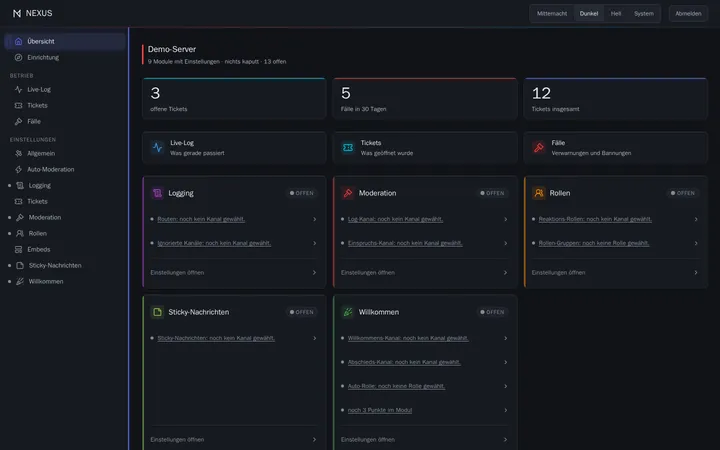
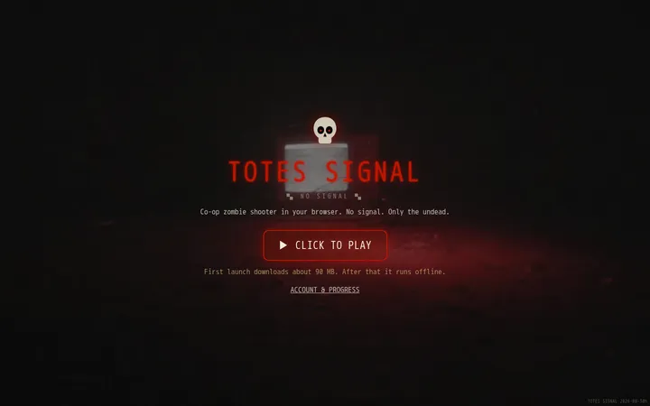
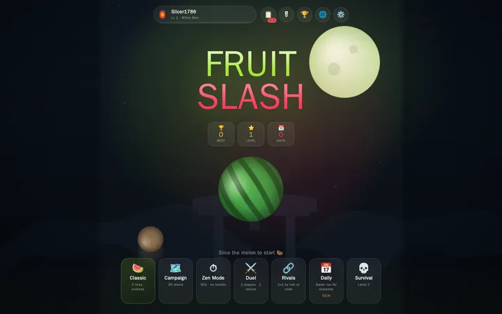
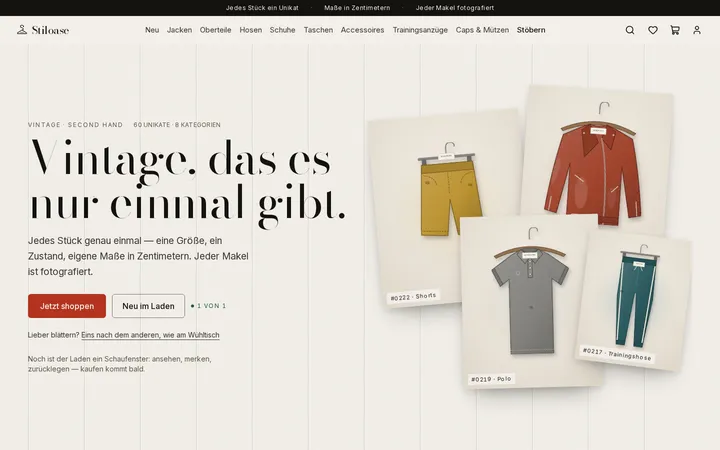
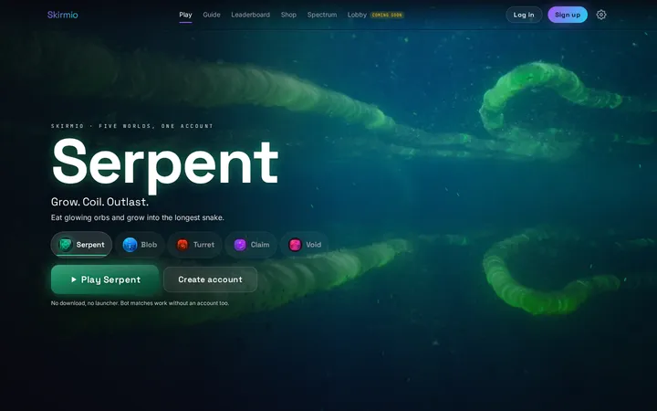
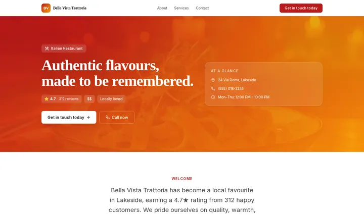
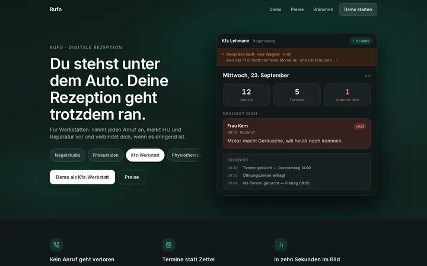

  <a href="https://kaufmeinewebsite.de/en"><b>kaufmeinewebsite.de</b></a> ·
  <a href="mailto:kontakt@kaufmeinewebsite.de">kontakt@kaufmeinewebsite.de</a> ·
  open for client projects and full-time roles
   
  🇩🇪 Full-Stack-Entwickler aus Deutschland. Web-Apps, Shops, Bots und Spiele, die live laufen und getestet sind.

---

### ⭐ Live work

Every project below is running right now. Click a picture to try it.

<table>
<tr>
<td width="50%" valign="top">

 <b>Relais</b>: AI CRM. Leads from Facebook, Instagram and Google Ads in one inbox; the AI answers when no human replies within five minutes, grounded in your knowledge base.
 <code>Next.js 16</code> <code>Better Auth</code> <code>Claude API</code> <code>pgvector</code>
 <a href="https://kaufmeinewebsite.de/relais/demo?lang=en">▶ Live demo, one click</a>
</td>
<td width="50%" valign="top">

 <b>VAULT</b>: self-hosted store for digital products. Five payment providers, fraud scoring, one-command Docker install.
 <code>Next.js 16</code> <code>Prisma</code> <code>PostgreSQL</code> <code>Docker</code>
 <a href="https://vault.kaufmeinewebsite.de">▶ Live demo</a> · <a href="https://github.com/nebulausername/vault">Showcase</a>
</td>
</tr>
<tr>
<td width="50%" valign="top">

 <b>NEXUS</b>: Discord bot with a panel builder <i>inside</i> Discord and a web dashboard. Tickets, moderation, logging, roles.
 <code>TypeScript</code> <code>discord.js</code> <code>Components V2</code> <code>SQLite</code>
 <a href="https://nexus.kaufmeinewebsite.de">▶ Try the demo</a> · <a href="https://github.com/nebulausername/nexus">Showcase</a> · beta 01.10.2026
</td>
<td width="50%" valign="top">

 <b>TOTES SIGNAL</b>: co-op zombie shooter in the browser, rebuilt for phones.
 Fork of <a href="https://github.com/nzp-team">Nazi Zombies: Portable</a> (open source, GPL-2.0). The game, engine and art are the NZ:P Team's work. I built the complete mobile version, the settings, German localisation, accounts, browser co-op and bot teammates. Work in progress.
 <code>FTEQW · WebGL</code> <code>QuakeC</code> <code>JavaScript</code> <code>WebRTC</code>
 <a href="https://totersignal.de">▶ Play</a> · <a href="https://github.com/nebulausername/totes-signal">Source</a> · <a href="https://github.com/nebulausername/totes-signal#credits-whats-theirs-whats-mine">Credits</a> · <a href="https://github.com/nebulausername/totes-signal/blob/main/ROADMAP.md">Roadmap</a>
</td>
</tr>
<tr>
<td width="50%" valign="top">

 <b>Fruit Slash</b>: juicy slice game in the browser. 17 languages, 7 modes, 48 achievements, 1v1 challenges by link.
 <code>JavaScript</code> <code>Canvas</code> <code>PWA</code>
 <a href="https://demo.kaufmeinewebsite.de/fruit-slash/">▶ Play</a>
</td>
<td width="50%" valign="top">

 <b>Stiloase</b>: vintage shop where every piece is one of a kind. Bag reservation, email-code accounts, every flaw photographed.
 <code>Next.js 16</code> <code>Better Auth</code> <code>Tailwind 4</code>
 <a href="https://kaufmeinewebsite.de/stiloase">▶ Visit</a>
</td>
</tr>
</table>

Also live: <a href="https://kaufmeinewebsite.de/yoursite">RECEIPTS</a> · <a href="https://kaufmeinewebsite.de/videos">Kopfkino</a> ·
and <a href="https://github.com/nebulausername/kaufmeinewebsite">the platform that hosts them all</a>.

### ⏸️ Built, paused until funded

Working prototypes. Client work comes first, so these are on hold; each one resumes with budget or a first paying customer.
 🇩🇪 Funktionierende Prototypen, vorerst pausiert. Weiter geht es, sobald Budget oder erste Kunden da sind.

<table>
<tr>
<td width="33%" valign="top">

 <b>Skirmio</b>: five io-style browser games, playable against bots.
 Paused: accounts, shop and real-time multiplayer.
 <a href="https://github.com/nebulausername/skirmio">Showcase &amp; roadmap</a>
</td>
<td width="33%" valign="top">

 <b>MapToWeb</b>: turns a Google Maps listing into a finished website with an editor.
 In development, launching as our own product.
 <a href="https://github.com/nebulausername/maptoweb">Showcase &amp; roadmap</a>
</td>
<td width="33%" valign="top">

 <b>Rufo</b> (KI-Rezeption): digital receptionist for trades and practices; sorts German requests into clean leads.
 Text trial built; phone line not connected yet.
 <a href="https://github.com/nebulausername/rufo">Showcase &amp; roadmap</a>
</td>
</tr>
</table>

### 🛠️ How I work

- **Tests decide what ships.** Guard tests pin whole classes of bugs, and every guard is made to fail on purpose once before it counts.
- **Measured in a real browser:** phone widths, keyboard only, the *built* CSS, not just the source.
- **Bilingual by default** (EN / DE), privacy-aware (GDPR), accessible.
- **AI pair-programming, openly.** I build with Claude Code; commits it co-wrote say so. Design, review and responsibility stay with me.

### 🔭 Right now

Building **Keel**, an AI SaaS MVP planner: type any product idea, get a scoped plan and the foundation to build it on.

### 🧰 Stack

